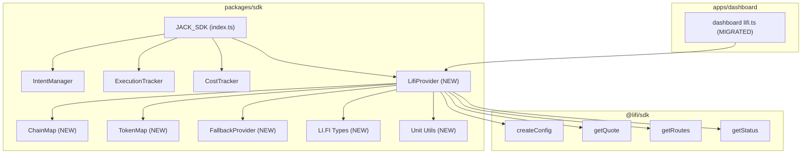

# Design Document: LI.FI SDK Integration

## Overview

This design integrates the official `@lifi/sdk` package into the JACK SDK (`packages/sdk`) as a new `LifiProvider` module. The provider wraps LI.FI's `createConfig`, `getQuote`, `getRoutes`, and `getStatus` functions behind a clean interface that accepts the existing `IntentParams` type. The dashboard's raw REST calls are replaced with imports from the SDK package.

Key design decisions:
- The LifiProvider is a standalone class (not a subclass of any existing manager) to keep concerns separated
- Chain/token resolution is extracted into pure mapping modules for testability
- Fallback logic is preserved as a first-class concern, not an afterthought
- Retry logic with exponential backoff is built into the LifiProvider for transient failures
- The `@lifi/sdk` dependency is a runtime dependency of `packages/sdk`, not a peer dependency, since it's an implementation detail
- This spec supersedes the earlier `lifi-integration` spec

Research sources: [LI.FI SDK Configuration](https://docs.li.fi/sdk/configure-sdk), [LI.FI Request Routes/Quotes](https://docs.li.fi/sdk/request-routes), [LI.FI Execute Routes](https://docs.li.fi/sdk/execute-routes). Content was rephrased for compliance with licensing restrictions.

## Architecture



The LifiProvider sits alongside IntentManager, ExecutionTracker, and CostTracker as a peer module exposed by JACK_SDK. It depends on `@lifi/sdk` for the actual LI.FI API calls and delegates to ChainMap/TokenMap for resolution and FallbackProvider when LI.FI is unavailable.

## Components and Interfaces

### 1. LifiProvider (`packages/sdk/src/lifi/lifi-provider.ts`)

The main entry point for all LI.FI operations. Handles initialization, parameter validation, SDK delegation, response normalization, retry logic, and fallback.

```typescript
import { createConfig, getQuote, getRoutes, getStatus } from '@lifi/sdk';

export interface LifiConfig {
  integrator?: string;       // default: "jackkernel", max 23 chars
  apiKey?: string;           // optional, for higher rate limits
  apiUrl?: string;           // default: "https://li.quest/v1"
  rpcUrls?: Record<number, string[]>; // chain ID -> RPC URLs
  chains?: number[];         // supported chain IDs, default: [42161, 10, 8453, 137]
  timeout?: number;          // request timeout in ms, default: 30000
  maxRetries?: number;       // max retry attempts, default: 3
  retryDelay?: number;       // initial retry delay in ms, default: 1000
}

export class LifiProvider {
  constructor(config?: LifiConfig);

  /** Fetch a quote for the given intent parameters */
  async fetchQuote(params: IntentParams): Promise<LifiQuotePayload>;

  /** Fetch the best route for the given intent parameters */
  async fetchRoute(params: IntentParams): Promise<LifiRoutePayload>;

  /** Check the status of a LI.FI transaction */
  async fetchStatus(txHash?: string): Promise<LifiStatusPayload>;
}
```

Internally, the constructor calls `createConfig({ integrator: config.integrator ?? "jackkernel", ... })`. Each public method:
1. Validates input params (returns fallback on invalid)
2. Resolves chains/tokens via ChainMap/TokenMap
3. Calls the corresponding `@lifi/sdk` function with retry logic
4. Normalizes the response into the SDK payload type
5. Falls back to FallbackProvider on any error

### 2. ChainMap (`packages/sdk/src/lifi/chain-map.ts`)

Pure mapping module for chain name to chain ID resolution.

```typescript
export type ChainResolution =
  | { ok: true; chainId: number }
  | { ok: false; reason: string };

export function resolveChain(name: string): ChainResolution;
export function getSupportedChains(): Record<string, number>;
```

Default mappings: `arbitrum→42161`, `optimism→10`, `base→8453`, `polygon→137`. Lookups are case-insensitive via `name.toLowerCase()`.

### 3. TokenMap (`packages/sdk/src/lifi/token-map.ts`)

Pure mapping module for token symbol to address resolution.

```typescript
export interface TokenInfo {
  address: string;
  decimals: number;
}

export type TokenResolution =
  | { ok: true; token: TokenInfo }
  | { ok: false; reason: string };

export function resolveToken(chainId: number, symbol: string): TokenResolution;
export function getSupportedTokens(chainId: number): Record<string, TokenInfo>;
```

Default mappings per chain for USDC, WETH, ETH with correct addresses and decimals (matching the existing dashboard mappings). Lookups are case-insensitive via `symbol.toUpperCase()`.

### 4. FallbackProvider (`packages/sdk/src/lifi/fallback.ts`)

Generates estimated quotes/routes/statuses when LI.FI is unavailable.

```typescript
export function buildFallbackQuote(
  params: IntentParams,
  reason: LifiFallback
): LifiQuotePayload;

export function buildFallbackRoute(
  params: IntentParams,
  reason: LifiFallback
): LifiRoutePayload;

export function buildFallbackStatus(
  txHash: string | undefined,
  reason: LifiFallback
): LifiStatusPayload;

export function deterministicId(seed: string): string;
```

The `deterministicId` function uses the DJB2 hash algorithm from the existing dashboard code to produce stable route IDs of the form `JK-LIFI-{hash}`.

### 5. LI.FI Types (`packages/sdk/src/lifi/types.ts`)

Shared type definitions for the LI.FI integration layer.

```typescript
export type LifiProviderType = 'lifi' | 'fallback';

export type LifiReasonCode =
  | 'MISSING_PARAMS'
  | 'INVALID_AMOUNT'
  | 'UNSUPPORTED_CHAIN'
  | 'UNSUPPORTED_TOKEN'
  | 'LIFI_BAD_REQUEST'
  | 'LIFI_RATE_LIMITED'
  | 'LIFI_SERVER_ERROR'
  | 'LIFI_UNAVAILABLE'
  | 'LIFI_EMPTY_RESPONSE'
  | 'MISSING_TX_HASH';

export interface LifiFallback {
  enabled: true;
  reasonCode: LifiReasonCode;
  message: string;
}

export interface LifiQuotePayload {
  provider: LifiProviderType;
  routeId: string;
  timestamp: number;
  quote: {
    amountIn: string;
    amountOut: string;
    minAmountOut?: string;
    fromChainId: number;
    toChainId: number;
    fromToken: string;
    toToken: string;
    estimatedGasUsd?: string;
  };
  raw?: unknown;
  fallback?: LifiFallback;
}

export interface LifiRoutePayload {
  provider: LifiProviderType;
  routeId: string;
  timestamp: number;
  route?: {
    fromChainId: number;
    toChainId: number;
    fromToken: string;
    toToken: string;
    steps?: unknown[];
    tags?: string[];
    estimatedDuration?: number;
  };
  raw?: unknown;
  fallback?: LifiFallback;
}

export interface LifiStatusPayload {
  provider: LifiProviderType;
  timestamp: number;
  status: {
    state: string;
    substatus?: string;
    txHash?: string;
  };
  raw?: unknown;
  fallback?: LifiFallback;
}
```

### 6. Unit Conversion Utilities (`packages/sdk/src/lifi/utils.ts`)

Pure functions for base unit conversion, extracted from the dashboard.

```typescript
export function toBaseUnits(amount: string, decimals: number): string;
export function fromBaseUnits(amount: string, decimals: number): string;
```

### 7. Retry Logic (internal to LifiProvider)

The LifiProvider includes a private `executeWithRetry` method:

```typescript
private async executeWithRetry<T>(fn: () => Promise<T>): Promise<T> {
  let delay = this.config.retryDelay;
  for (let attempt = 0; attempt <= this.config.maxRetries; attempt++) {
    try {
      return await fn();
    } catch (error) {
      if (!this.isRetryable(error) || attempt === this.config.maxRetries) {
        throw error;
      }
      await this.sleep(delay);
      delay *= 2; // exponential backoff
    }
  }
  throw new Error('Retry exhausted');
}

private isRetryable(error: unknown): boolean {
  // Retry on rate limit (429) and server errors (5xx)
  // Do not retry on client errors (4xx except 429)
}
```

### 8. JACK_SDK Extension

The main `JACK_SDK` class gains an optional `lifi` property:

```typescript
export class JACK_SDK {
  // ... existing properties ...
  public readonly lifi?: LifiProvider;

  constructor(config: ClientConfig & { lifi?: LifiConfig }) {
    // ... existing init ...
    if (config.lifi !== undefined) {
      this.lifi = new LifiProvider(config.lifi);
    }
  }

  /** Convenience: get a LI.FI quote for intent params */
  async getLifiQuote(params: IntentParams): Promise<LifiQuotePayload> {
    if (!this.lifi) throw new Error('LI.FI not configured');
    return this.lifi.fetchQuote(params);
  }

  /** Convenience: get a LI.FI route for intent params */
  async getLifiRoute(params: IntentParams): Promise<LifiRoutePayload> {
    if (!this.lifi) throw new Error('LI.FI not configured');
    return this.lifi.fetchRoute(params);
  }
}
```

### 9. Dashboard Migration

The file `apps/dashboard/src/lib/lifi.ts` is refactored to import from `@jack-kernel/sdk`:

```typescript
import { LifiProvider } from '@jack-kernel/sdk';
import type { LifiQuotePayload, LifiRoutePayload, LifiStatusPayload } from '@jack-kernel/sdk';

const provider = new LifiProvider({ integrator: 'jackkernel' });

export const fetchLifiQuote = (params: IntentParams) => provider.fetchQuote(params);
export const fetchLifiRoute = (params: IntentParams) => provider.fetchRoute(params);
export const fetchLifiStatus = (txHash?: string) => provider.fetchStatus(txHash);
```

This preserves the same export signatures so dashboard consumers don't need changes.

### 10. SDK Barrel Export (`packages/sdk/src/index.ts`)

New exports added:

```typescript
export { LifiProvider } from './lifi/lifi-provider.js';
export type { LifiConfig } from './lifi/lifi-provider.js';
export type {
  LifiProviderType, LifiReasonCode, LifiFallback,
  LifiQuotePayload, LifiRoutePayload, LifiStatusPayload
} from './lifi/types.js';
export { resolveChain, getSupportedChains } from './lifi/chain-map.js';
export { resolveToken, getSupportedTokens } from './lifi/token-map.js';
export { toBaseUnits, fromBaseUnits } from './lifi/utils.js';
```

## Data Models

### LifiConfig

| Field | Type | Required | Default | Description |
|-------|------|----------|---------|-------------|
| integrator | string | No | "jackkernel" | LI.FI integrator identifier (max 23 chars) |
| apiKey | string | No | undefined | API key for higher rate limits |
| apiUrl | string | No | "https://li.quest/v1" | LI.FI API base URL |
| rpcUrls | Record<number, string[]> | No | {} | Custom RPC URLs per chain ID |
| chains | number[] | No | [42161, 10, 8453, 137] | Supported chain IDs |
| timeout | number | No | 30000 | Request timeout in ms |
| maxRetries | number | No | 3 | Max retry attempts for retryable errors |
| retryDelay | number | No | 1000 | Initial retry delay in ms |

### ChainMap (default entries)

| Chain Name | Chain ID |
|-----------|----------|
| arbitrum | 42161 |
| optimism | 10 |
| base | 8453 |
| polygon | 137 |

### TokenMap (default entries per chain)

| Chain ID | Symbol | Address | Decimals |
|----------|--------|---------|----------|
| 42161 | USDC | 0xFF970A61A04b1cA14834A43f5dE4533eBDDB5CC8 | 6 |
| 42161 | WETH | 0x82aF49447D8a07e3bd95BD0d56f35241523fBab1 | 18 |
| 42161 | ETH | 0xEeeeeEeeeEeEeeEeEeEeeEEEeeeeEeeeeeeeEEeE | 18 |
| 10 | USDC | 0x7F5c764cBc14f9669B88837ca1490cCa17c31607 | 6 |
| 10 | WETH | 0x4200000000000000000000000000000000000006 | 18 |
| 10 | ETH | 0xEeeeeEeeeEeEeeEeEeEeeEEEeeeeEeeeeeeeEEeE | 18 |
| 8453 | USDC | 0x833589fCD6eDb6E08f4c7C32D4f71b54bdA02913 | 6 |
| 8453 | WETH | 0x4200000000000000000000000000000000000006 | 18 |
| 8453 | ETH | 0xEeeeeEeeeEeEeeEeEeEeeEEEeeeeEeeeeeeeEEeE | 18 |
| 137 | USDC | 0x2791Bca1f2de4661ED88A30C99A7a9449Aa84174 | 6 |
| 137 | WETH | 0x7ceB23fD6bC0adD59E62ac25578270cFf1b9f619 | 18 |
| 137 | ETH | 0xEeeeeEeeeEeEeeEeEeEeeEEEeeeeEeeeeeeeEEeE | 18 |

### Fallback Rates (static)

| Pair | Rate |
|------|------|
| USDC:WETH | 0.0004 |
| USDC:ETH | 0.0004 |
| ETH:USDC | 2500 |
| WETH:USDC | 2500 |
| ETH:WETH | 1 |
| WETH:ETH | 1 |


## Correctness Properties

*A property is a characteristic or behavior that should hold true across all valid executions of a system — essentially, a formal statement about what the system should do. Properties serve as the bridge between human-readable specifications and machine-verifiable correctness guarantees.*

### Property 1: Chain resolution is correct and case-insensitive

*For any* supported chain name and *for any* casing variation of that name, `resolveChain` should return `ok: true` with the correct numeric chain ID.

**Validates: Requirements 2.1, 2.5**

### Property 2: Unsupported chain names produce error results

*For any* string that is not a supported chain name (in any casing), `resolveChain` should return `ok: false` with a non-empty reason string.

**Validates: Requirements 2.2**

### Property 3: Token resolution is correct and case-insensitive

*For any* supported chain ID and token symbol, and *for any* casing variation of that symbol, `resolveToken` should return `ok: true` with the correct on-chain address and decimal count.

**Validates: Requirements 2.3, 2.6**

### Property 4: Unsupported tokens produce error results

*For any* chain ID and *for any* string that is not a supported token symbol on that chain, `resolveToken` should return `ok: false` with a non-empty reason string.

**Validates: Requirements 2.4**

### Property 5: Base unit conversion round-trip

*For any* non-negative numeric string with at most `decimals` fractional digits, converting to base units via `toBaseUnits` and back via `fromBaseUnits` should produce a value equivalent to the original.

**Validates: Requirements 3.3**

### Property 6: All quote responses conform to LifiQuotePayload shape

*For any* input to `fetchQuote` (whether valid or invalid IntentParams), the returned object should always have a `provider` field that is either `"lifi"` or `"fallback"`, a numeric `timestamp`, a string `routeId`, and a `quote` object with `amountIn`, `amountOut`, `fromChainId`, `toChainId`, `fromToken`, and `toToken` fields.

**Validates: Requirements 3.2, 3.8**

### Property 7: Missing intent params produce fallback without SDK call

*For any* `IntentParams` object missing at least one required field (sourceChain, destinationChain, tokenIn, tokenOut, or amountIn), `fetchQuote` should return a payload with `provider: "fallback"` and `fallback.reasonCode: "MISSING_PARAMS"`.

**Validates: Requirements 3.7**

### Property 8: Route normalization produces complete payloads

*For any* valid LI.FI SDK route response containing at least one route, the normalized `LifiRoutePayload` should contain a `route` object with `fromChainId`, `toChainId`, `fromToken`, `toToken`, and `steps` fields, and `provider` should be `"lifi"`.

**Validates: Requirements 4.2**

### Property 9: Best route selection maximizes output

*For any* set of two or more LI.FI routes with different output amounts, the selected route should have the highest `toAmount` among all returned routes.

**Validates: Requirements 4.3**

### Property 10: Fallback payloads have correct structure and use static rates

*For any* fallback quote or route, the `provider` field should be `"fallback"`, the `fallback` field should have `enabled: true` with a valid `reasonCode` and non-empty `message`, and for known token pairs the output amount should equal `amountIn * staticRate`.

**Validates: Requirements 5.1, 5.2, 5.3, 5.5**

### Property 11: Deterministic ID is idempotent

*For any* string seed, calling `deterministicId(seed)` multiple times should always produce the same result, and the result should match the pattern `JK-LIFI-[A-Z0-9]+`.

**Validates: Requirements 5.4**

### Property 12: Retry logic retries retryable errors and falls back on exhaustion

*For any* retryable error (rate limit or server error) and *for any* maxRetries value N >= 1, the LifiProvider should attempt the SDK call exactly N+1 times before returning a fallback payload.

**Validates: Requirements 6.1, 6.2**

### Property 13: Status normalization produces complete payloads

*For any* valid LI.FI SDK status response, the normalized `LifiStatusPayload` should contain a `status` object with a `state` string and `txHash`, and `provider` should be `"lifi"`.

**Validates: Requirements 7.2**

### Property 14: Gas cost is a string when present

*For any* LifiQuotePayload where the LI.FI SDK returned gas cost data, the `estimatedGasUsd` field should be a string.

**Validates: Requirements 8.1, 8.2**

### Property 15: LifiQuotePayload JSON round-trip

*For any* valid `LifiQuotePayload` object, `JSON.parse(JSON.stringify(payload))` should produce a deeply equal object.

**Validates: Requirements 10.3**

### Property 16: LifiRoutePayload JSON round-trip

*For any* valid `LifiRoutePayload` object, `JSON.parse(JSON.stringify(payload))` should produce a deeply equal object.

**Validates: Requirements 10.4**

## Error Handling

| Error Scenario | Behavior | Reason Code |
|---------------|----------|-------------|
| Missing required IntentParams fields | Return fallback payload | `MISSING_PARAMS` |
| Invalid/non-positive amount | Return fallback payload | `INVALID_AMOUNT` |
| Unsupported chain name | Return fallback payload | `UNSUPPORTED_CHAIN` |
| Unsupported token symbol | Return fallback payload | `UNSUPPORTED_TOKEN` |
| LI.FI SDK throws (network error) | Catch, return fallback payload | `LIFI_UNAVAILABLE` |
| LI.FI SDK returns HTTP 400/422 | Return fallback immediately (no retry) | `LIFI_BAD_REQUEST` |
| LI.FI SDK returns HTTP 429 | Retry with backoff, then fallback | `LIFI_RATE_LIMITED` |
| LI.FI SDK returns HTTP 5xx | Retry with backoff, then fallback | `LIFI_SERVER_ERROR` |
| LI.FI SDK returns empty/null response | Return fallback payload | `LIFI_EMPTY_RESPONSE` |
| No transaction hash for status check | Return fallback status | `MISSING_TX_HASH` |
| `createConfig` throws during init | Re-throw with descriptive message | N/A (constructor error) |
| All retries exhausted | Return fallback with original reason | Original reason code |

All error paths produce valid payloads (never throw from `fetchQuote`/`fetchRoute`/`fetchStatus`). Only the constructor may throw.

## Testing Strategy

### Testing Framework

- **Unit tests**: vitest (already configured in `packages/sdk`)
- **Property-based tests**: `fast-check` with `@fast-check/vitest` (already installed as dev dependencies)
- **Mocking**: `vitest` built-in mocking (`vi.mock`) for `@lifi/sdk` functions

### Unit Tests

Unit tests cover specific examples, edge cases, and integration points:

- LifiProvider constructor with various config combinations (Req 1.1–1.7)
- LI.FI SDK function mocking for happy paths (Req 3.1, 4.1, 7.1)
- Error scenario handling: network errors, bad requests, rate limiting, empty responses (Req 3.4–3.6, 4.4–4.5, 7.3–7.4)
- Non-retryable errors return immediately (Req 6.3)
- Dashboard migration smoke tests (Req 9.1–9.4)
- JACK_SDK integration: lifi property exposed, convenience methods delegate (Req 1.6–1.7)
- Invalid JSON deserialization throws (Req 10.5)

### Property-Based Tests

Each correctness property maps to a single property-based test using `fast-check`. Tests run a minimum of 100 iterations.

Each test is tagged with: `Feature: lifi-sdk-integration, Property {N}: {title}`

Property tests are organized in `packages/sdk/tests/property/`:

| Test File | Properties Covered |
|-----------|-------------------|
| `lifi-chain-map.property.test.ts` | Properties 1, 2 |
| `lifi-token-map.property.test.ts` | Properties 3, 4 |
| `lifi-unit-conversion.property.test.ts` | Property 5 |
| `lifi-normalization.property.test.ts` | Properties 6, 8, 13, 14 |
| `lifi-fallback.property.test.ts` | Properties 7, 9, 10, 11 |
| `lifi-retry.property.test.ts` | Property 12 |
| `lifi-serialization.property.test.ts` | Properties 15, 16 |

### Test Generators

Custom `fast-check` arbitraries for:
- `arbIntentParams`: generates valid IntentParams with supported chains/tokens
- `arbIncompleteIntentParams`: generates IntentParams missing at least one required field
- `arbLifiQuoteResponse`: generates mock LI.FI SDK quote response objects
- `arbLifiRouteResponse`: generates mock LI.FI SDK route response objects with variable route counts
- `arbLifiStatusResponse`: generates mock LI.FI SDK status response objects
- `arbLifiQuotePayload`: generates valid LifiQuotePayload objects
- `arbLifiRoutePayload`: generates valid LifiRoutePayload objects
- `arbNumericString`: generates non-negative numeric strings with controlled decimal places
- `arbChainName`: generates supported chain names with random casing
- `arbTokenSymbol`: generates supported token symbols with random casing
- `arbUnsupportedString`: generates strings not in the supported chain/token sets
