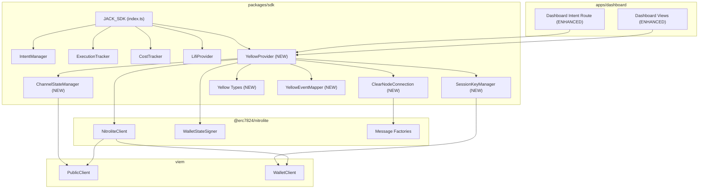

# Design Document: Yellow Network Integration

## Overview

This design integrates Yellow Network's Nitrolite SDK (`@erc7824/nitrolite`) into the JACK SDK (`packages/sdk`) as a new `YellowProvider` module. The provider wraps the full ERC-7824 state channel lifecycle — authentication, channel creation, resize, offchain transfers, clearing, and close/withdrawal — behind a clean interface that accepts the existing `IntentParams` type and plugs into the JACK intent flow.

Key design decisions:
- The YellowProvider follows the same standalone-class pattern as LifiProvider (not a subclass of any existing manager)
- WebSocket connection management is encapsulated in a `ClearNodeConnection` class with reconnection logic and request-response correlation
- Session key management is handled internally — callers provide a viem WalletClient, and the provider manages ephemeral session keys
- Channel lifecycle operations (create, resize, close) are two-phase: first an offchain ClearNode message, then an on-chain NitroliteClient transaction
- All public methods return result objects (never throw) following the LifiProvider fallback pattern, except the constructor which may throw
- BigInt values from the Nitrolite SDK are serialized as strings in all public-facing types for JSON compatibility
- The `@erc7824/nitrolite` package is a runtime dependency of `packages/sdk`

Research sources: [Yellow Network Quickstart](https://docs.yellow.org/docs/learn/getting-started/quickstart), [Yellow SDK API Reference](https://docs.yellow.org/docs/api-reference), [Yellow Quick Start Guide](https://docs.yellow.org/docs/build/quick-start). Content was rephrased for compliance with licensing restrictions.

## Architecture



The YellowProvider sits alongside LifiProvider as a peer module exposed by JACK_SDK. It depends on `@erc7824/nitrolite` for on-chain operations and manages its own WebSocket connection to ClearNode for offchain messaging.

## Components and Interfaces

### 1. YellowProvider (`packages/sdk/src/yellow/yellow-provider.ts`)

The main entry point for all Yellow Network operations. Orchestrates session management, channel lifecycle, clearing, and event mapping.

```typescript
import { NitroliteClient, WalletStateSigner } from '@erc7824/nitrolite';

export interface YellowConfig {
  clearNodeUrl?: string;          // default: "wss://clearnet-sandbox.yellow.com/ws"
  custodyAddress: `0x${string}`;  // custody contract address
  adjudicatorAddress: `0x${string}`; // adjudicator contract address
  chainId: number;                // chain ID for on-chain operations
  rpcUrl?: string;                // RPC URL for the chain
  challengeDuration?: number;     // seconds, default: 3600
  sessionExpiry?: number;         // seconds, default: 3600
  messageTimeout?: number;        // ms, default: 30000
  maxReconnectAttempts?: number;  // default: 5
  reconnectDelay?: number;        // ms, default: 1000
}

export class YellowProvider {
  constructor(config: YellowConfig, walletClient: WalletClient);

  /** Connect to ClearNode and authenticate */
  async connect(): Promise<YellowConnectionResult>;

  /** Disconnect from ClearNode */
  async disconnect(): Promise<void>;

  /** Create a new state channel */
  async createChannel(params: CreateChannelParams): Promise<YellowChannelResult>;

  /** Resize a channel's allocations */
  async resizeChannel(params: ResizeChannelParams): Promise<YellowChannelResult>;

  /** Close a channel and optionally withdraw */
  async closeChannel(params: CloseChannelParams): Promise<YellowChannelResult>;

  /** Send an offchain transfer */
  async transfer(params: TransferParams): Promise<YellowTransferResult>;

  /** Execute an intent via Yellow clearing */
  async executeIntent(params: IntentParams): Promise<YellowExecutionResult>;

  /** Query channel list and balances */
  async getChannels(): Promise<YellowChannelsResult>;

  /** Query a specific channel's on-chain state */
  async getChannelState(channelId: string): Promise<YellowChannelResult>;

  /** Check if provider is connected and authenticated */
  get isConnected(): boolean;

  /** Register event listener */
  on(event: YellowEvent, handler: YellowEventHandler): void;

  /** Remove event listener */
  off(event: YellowEvent, handler: YellowEventHandler): void;
}
```

Internally, the constructor initializes the NitroliteClient with viem clients and contract addresses. The `connect()` method establishes the WebSocket, generates a session key, and completes the auth handshake. Each channel operation follows the two-phase pattern: send ClearNode message → submit on-chain transaction.

### 2. ClearNodeConnection (`packages/sdk/src/yellow/clear-node-connection.ts`)

Manages the WebSocket connection to ClearNode with reconnection logic and request-response correlation.

```typescript
export class ClearNodeConnection {
  constructor(url: string, options?: ConnectionOptions);

  /** Establish WebSocket connection */
  async connect(): Promise<void>;

  /** Close connection and clean up */
  async disconnect(): Promise<void>;

  /** Send a message and wait for the correlated response */
  async sendAndWait<T>(message: string, method: string, timeout?: number): Promise<T>;

  /** Send a message without waiting for response */
  send(message: string): void;

  /** Register handler for incoming messages */
  onMessage(handler: (data: unknown) => void): void;

  /** Connection state */
  get isConnected(): boolean;
}

export interface ConnectionOptions {
  maxReconnectAttempts?: number;  // default: 5
  reconnectDelay?: number;        // ms, default: 1000
  messageTimeout?: number;        // ms, default: 30000
}
```

The `sendAndWait` method creates a Promise that resolves when a response with a matching method name is received, or rejects on timeout. Reconnection uses exponential backoff: `delay * 2^attempt`.

### 3. SessionKeyManager (`packages/sdk/src/yellow/session-key-manager.ts`)

Handles session key generation, authentication flow, and session lifecycle.

```typescript
export class SessionKeyManager {
  constructor(walletClient: WalletClient, connection: ClearNodeConnection);

  /** Generate session key and authenticate with ClearNode */
  async authenticate(params: AuthParams): Promise<SessionInfo>;

  /** Check if current session is valid */
  get isAuthenticated(): boolean;

  /** Get the session signer for message signing */
  get sessionSigner(): MessageSigner;

  /** Get the session key address */
  get sessionAddress(): string;

  /** Invalidate current session */
  invalidate(): void;
}

export interface AuthParams {
  allowances: Array<{ asset: string; amount: string }>;
  expiresAt?: number;   // unix timestamp, default: now + sessionExpiry
  scope?: string;       // default: "jack-kernel"
}

export interface SessionInfo {
  sessionAddress: string;
  expiresAt: number;
  authenticated: boolean;
}
```

The authentication flow:
1. Generate session keypair via `generatePrivateKey()` + `privateKeyToAccount()`
2. Create `auth_request` message with session key, allowances, expiry
3. Receive `auth_challenge` from ClearNode
4. Sign challenge with main wallet via `createEIP712AuthMessageSigner`
5. Send `auth_verify` with signed challenge
6. Receive confirmation and store session state

### 4. ChannelStateManager (`packages/sdk/src/yellow/channel-state-manager.ts`)

Tracks local channel state and provides on-chain query capabilities.

```typescript
export class ChannelStateManager {
  constructor(publicClient: PublicClient, custodyAddress: `0x${string}`);

  /** Update local channel state from ClearNode response */
  updateChannel(channelId: string, state: ChannelState): void;

  /** Get locally cached channel state */
  getChannel(channelId: string): ChannelState | undefined;

  /** Get all locally cached channels */
  getAllChannels(): ChannelState[];

  /** Query on-chain channel balances */
  async queryOnChainBalances(channelId: string, tokens: string[]): Promise<bigint[]>;

  /** Find an open channel for a given token */
  findOpenChannel(token: string): ChannelState | undefined;

  /** Clear all cached state */
  clear(): void;
}
```

### 5. YellowEventMapper (`packages/sdk/src/yellow/event-mapper.ts`)

Maps Yellow Network events and channel lifecycle events to JACK ExecutionStatus values. This extracts and formalizes the mapping logic currently embedded in the dashboard's `route.ts`.

```typescript
import { ExecutionStatus } from '../types.js';

export interface MappedEvent {
  executionStatus: ExecutionStatus;
  stepLabel: string;
  stepStatus: 'COMPLETED' | 'IN_PROGRESS' | 'PENDING' | 'FAILED';
  isTerminal: boolean;
}

/** Map a Yellow Network event name to JACK execution status */
export function mapYellowEvent(event: string): MappedEvent | undefined;

/** Map a channel status to JACK execution status */
export function mapChannelStatus(status: string): MappedEvent | undefined;

/** Map a state intent to JACK execution status */
export function mapStateIntent(intent: string): MappedEvent | undefined;

/** Infer the best mapping from a notification payload */
export function inferMapping(notification: {
  event?: string;
  channelStatus?: string;
  stateIntent?: string;
}): MappedEvent | undefined;
```

Event mapping table (extracted from existing dashboard code):

| Yellow Event | ExecutionStatus | Step Status |
|---|---|---|
| quote_accepted, solver_quoted | QUOTED | COMPLETED |
| execution_started, routing_started | EXECUTING | IN_PROGRESS |
| settlement_submitted | SETTLING | IN_PROGRESS |
| settled, settlement_finalized | SETTLED | COMPLETED |
| failed, execution_failed, settlement_failed | ABORTED | FAILED |
| expired | EXPIRED | FAILED |
| canceled | ABORTED | FAILED |

Channel status mapping:

| Channel Status | ExecutionStatus | Step Status |
|---|---|---|
| VOID | CREATED | COMPLETED |
| INITIAL | QUOTED | IN_PROGRESS |
| ACTIVE | EXECUTING | IN_PROGRESS |
| DISPUTE | EXECUTING | IN_PROGRESS |
| FINAL | SETTLED | COMPLETED |

State intent mapping:

| State Intent | ExecutionStatus | Step Status |
|---|---|---|
| INITIALIZE | QUOTED | IN_PROGRESS |
| OPERATE | EXECUTING | IN_PROGRESS |
| RESIZE | EXECUTING | COMPLETED |
| FINALIZE | SETTLED | COMPLETED |

### 6. Yellow Types (`packages/sdk/src/yellow/types.ts`)

Shared type definitions for the Yellow integration layer.

```typescript
export type YellowProviderStatus = 'connected' | 'disconnected' | 'connecting' | 'error';

export type YellowReasonCode =
  | 'MISSING_PARAMS'
  | 'UNSUPPORTED_CHAIN'
  | 'INSUFFICIENT_BALANCE'
  | 'INSUFFICIENT_CHANNEL_BALANCE'
  | 'NO_SOLVER_QUOTES'
  | 'YELLOW_UNAVAILABLE'
  | 'YELLOW_TX_FAILED'
  | 'YELLOW_AUTH_FAILED'
  | 'YELLOW_TIMEOUT'
  | 'YELLOW_CHANNEL_DISPUTE'
  | 'YELLOW_WS_ERROR';

export interface YellowFallback {
  enabled: true;
  reasonCode: YellowReasonCode;
  message: string;
}

export interface ChannelState {
  channelId: string;
  status: 'VOID' | 'INITIAL' | 'ACTIVE' | 'DISPUTE' | 'FINAL';
  chainId: number;
  token: string;
  allocations: ChannelAllocation[];
  stateVersion: number;
  stateIntent: string;
  stateHash?: string;
  adjudicator: string;
  challengePeriod: number;
  challengeExpiration?: number;
  createdAt: number;
  updatedAt: number;
}

export interface ChannelAllocation {
  destination: string;
  token: string;
  amount: string;  // BigInt serialized as string
}

export interface YellowQuote {
  solverId: string;
  channelId: string;
  amountIn: string;
  amountOut: string;
  estimatedTime: number;
  timestamp: number;
}

export interface ClearingResult {
  channelId: string;
  matchedAmountIn: string;
  matchedAmountOut: string;
  netSettlement: string;
  settlementProof?: SettlementProof;
  timestamp: number;
}

export interface SettlementProof {
  stateHash: string;
  signatures: string[];
  txHash?: string;
  finalAllocations: ChannelAllocation[];
}

// Result types (never-throw pattern)
export interface YellowConnectionResult {
  connected: boolean;
  sessionAddress?: string;
  fallback?: YellowFallback;
}

export interface YellowChannelResult {
  channelId?: string;
  state?: ChannelState;
  txHash?: string;
  fallback?: YellowFallback;
}

export interface YellowTransferResult {
  success: boolean;
  updatedAllocations?: ChannelAllocation[];
  fallback?: YellowFallback;
}

export interface YellowExecutionResult {
  provider: 'yellow' | 'fallback';
  intentId?: string;
  quote?: YellowQuote;
  clearing?: ClearingResult;
  channelId?: string;
  timestamp: number;
  fallback?: YellowFallback;
}

export interface YellowChannelsResult {
  channels: ChannelState[];
  fallback?: YellowFallback;
}

export type YellowEvent =
  | 'connected'
  | 'disconnected'
  | 'channel_created'
  | 'channel_resized'
  | 'channel_closed'
  | 'transfer_completed'
  | 'quote_received'
  | 'clearing_completed'
  | 'error';

export type YellowEventHandler = (data: unknown) => void;

// Params types
export interface CreateChannelParams {
  chainId: number;
  token: string;
}

export interface ResizeChannelParams {
  channelId: string;
  allocateAmount: string;  // amount to allocate from unified balance
  fundsDestination?: string;
}

export interface CloseChannelParams {
  channelId: string;
  withdraw?: boolean;  // default: true
}

export interface TransferParams {
  destination: string;
  allocations: Array<{ asset: string; amount: string }>;
}
```

### 7. JACK_SDK Extension

The main `JACK_SDK` class gains an optional `yellow` property:

```typescript
export class JACK_SDK {
  // ... existing properties ...
  public readonly yellow?: YellowProvider;

  constructor(config: ClientConfig & { lifi?: LifiConfig; yellow?: YellowConfig }) {
    // ... existing init ...
    if (config.yellow !== undefined) {
      // YellowProvider requires a walletClient, which must be provided separately
      // via a setup method or passed in config
      this.yellow = new YellowProvider(config.yellow, config.yellow.walletClient);
    }
  }
}
```

### 8. SDK Barrel Export (`packages/sdk/src/index.ts`)

New exports added:

```typescript
export { YellowProvider } from './yellow/yellow-provider.js';
export type { YellowConfig } from './yellow/yellow-provider.js';
export type {
  YellowProviderStatus, YellowReasonCode, YellowFallback,
  ChannelState, ChannelAllocation, YellowQuote, ClearingResult,
  SettlementProof, YellowConnectionResult, YellowChannelResult,
  YellowTransferResult, YellowExecutionResult, YellowChannelsResult,
  YellowEvent, YellowEventHandler,
  CreateChannelParams, ResizeChannelParams, CloseChannelParams, TransferParams
} from './yellow/types.js';
export { mapYellowEvent, mapChannelStatus, mapStateIntent, inferMapping } from './yellow/event-mapper.js';
```

### 9. Dashboard Enhancement

The existing `apps/dashboard/src/app/api/intents/route.ts` is enhanced to optionally use the YellowProvider for active operations. The existing notification ingestion path remains unchanged for backward compatibility.

A new dashboard utility file `apps/dashboard/src/lib/yellow.ts` wraps the SDK:

```typescript
import { YellowProvider } from '@jack-kernel/sdk';
import type { YellowConfig, YellowExecutionResult, YellowChannelsResult } from '@jack-kernel/sdk';

let provider: YellowProvider | null = null;

export function initYellowProvider(config: YellowConfig, walletClient: WalletClient): YellowProvider {
  provider = new YellowProvider(config, walletClient);
  return provider;
}

export function getYellowProvider(): YellowProvider | null {
  return provider;
}
```

Dashboard views are enhanced to display:
- State channel ID and status for Yellow-routed intents
- Channel allocation visualization
- Settlement proof details (state hash, signatures, tx hash)

## Data Models

### YellowConfig

| Field | Type | Required | Default | Description |
|-------|------|----------|---------|-------------|
| clearNodeUrl | string | No | "wss://clearnet-sandbox.yellow.com/ws" | ClearNode WebSocket URL |
| custodyAddress | `0x${string}` | Yes | — | Custody contract address |
| adjudicatorAddress | `0x${string}` | Yes | — | Adjudicator contract address |
| chainId | number | Yes | — | Chain ID for on-chain operations |
| rpcUrl | string | No | undefined | RPC URL for the chain |
| challengeDuration | number | No | 3600 | Challenge period in seconds |
| sessionExpiry | number | No | 3600 | Session key expiry in seconds |
| messageTimeout | number | No | 30000 | WebSocket message timeout in ms |
| maxReconnectAttempts | number | No | 5 | Max WebSocket reconnection attempts |
| reconnectDelay | number | No | 1000 | Initial reconnection delay in ms |

### ChannelState

| Field | Type | Description |
|-------|------|-------------|
| channelId | string | Deterministic channel identifier (bytes32 hex) |
| status | string | VOID, INITIAL, ACTIVE, DISPUTE, or FINAL |
| chainId | number | Chain ID where channel is deployed |
| token | string | Token address for the channel |
| allocations | ChannelAllocation[] | Current balance distribution |
| stateVersion | number | Monotonically increasing state version |
| stateIntent | string | Current state intent (INITIALIZE, OPERATE, RESIZE, FINALIZE) |
| stateHash | string? | Hash of the current state |
| adjudicator | string | Adjudicator contract address |
| challengePeriod | number | Challenge period in seconds |
| challengeExpiration | number? | Unix timestamp when challenge expires |
| createdAt | number | Unix timestamp of channel creation |
| updatedAt | number | Unix timestamp of last update |

### Event-to-Status Mapping (consolidated)

| Source | Event/Status | ExecutionStatus | Terminal |
|--------|-------------|-----------------|----------|
| Yellow Event | quote_accepted | QUOTED | No |
| Yellow Event | solver_quoted | QUOTED | No |
| Yellow Event | execution_started | EXECUTING | No |
| Yellow Event | routing_started | EXECUTING | No |
| Yellow Event | settlement_submitted | SETTLING | No |
| Yellow Event | settled | SETTLED | Yes |
| Yellow Event | settlement_finalized | SETTLED | Yes |
| Yellow Event | failed | ABORTED | Yes |
| Yellow Event | expired | EXPIRED | Yes |
| Yellow Event | canceled | ABORTED | Yes |
| Channel Status | VOID | CREATED | No |
| Channel Status | INITIAL | QUOTED | No |
| Channel Status | ACTIVE | EXECUTING | No |
| Channel Status | DISPUTE | EXECUTING | No |
| Channel Status | FINAL | SETTLED | Yes |
| State Intent | INITIALIZE | QUOTED | No |
| State Intent | OPERATE | EXECUTING | No |
| State Intent | RESIZE | EXECUTING | No |
| State Intent | FINALIZE | SETTLED | Yes |


## Correctness Properties

*A property is a characteristic or behavior that should hold true across all valid executions of a system — essentially, a formal statement about what the system should do. Properties serve as the bridge between human-readable specifications and machine-verifiable correctness guarantees.*

### Property 1: Challenge duration is converted to BigInt

*For any* positive integer challenge duration provided in YellowConfig, the NitroliteClient should receive it as a BigInt value equal to the original integer.

**Validates: Requirements 1.3**

### Property 2: Session keypairs are unique

*For any* N session key generation requests (N >= 2), all generated session addresses should be distinct from each other.

**Validates: Requirements 2.1**

### Property 3: Auth request message contains required fields

*For any* set of token allowances and expiry timestamp, the auth_request message sent to ClearNode should contain the session key address, the provided allowances, the expiry timestamp, and the application scope.

**Validates: Requirements 2.2**

### Property 4: ChannelState structural invariant

*For any* ChannelState object returned by the YellowProvider (from creation, resize, close, or query), the object should contain a non-empty channelId, a status that is one of VOID/INITIAL/ACTIVE/DISPUTE/FINAL, at least one allocation with destination/token/amount fields, a token address, and a chainId.

**Validates: Requirements 7.3, 3.3**

### Property 5: Resize preserves channel identity and updates allocations

*For any* successful channel resize operation, the returned ChannelState should have the same channelId as the input, and the allocations should reflect the requested allocation change.

**Validates: Requirements 4.3**

### Property 6: Close produces FINAL status

*For any* successful channel close operation, the returned ChannelState should have status FINAL and a non-empty txHash.

**Validates: Requirements 5.3**

### Property 7: Transfer exceeding channel balance is rejected

*For any* transfer request where the amount exceeds the sender's current channel allocation, the YellowProvider should return a result with `success: false` and `fallback.reasonCode` equal to "INSUFFICIENT_CHANNEL_BALANCE".

**Validates: Requirements 6.3**

### Property 8: YellowQuote normalization produces complete objects

*For any* solver quote response from ClearNode, the normalized YellowQuote should contain non-empty solverId, channelId, amountIn, amountOut, a positive estimatedTime, and a positive timestamp.

**Validates: Requirements 8.2**

### Property 9: ClearingResult contains required settlement data

*For any* completed clearing operation, the ClearingResult should contain a non-empty channelId, matchedAmountIn, matchedAmountOut, netSettlement, and a positive timestamp.

**Validates: Requirements 8.3**

### Property 10: Invalid intent params produce fallback without channel creation

*For any* IntentParams missing at least one required field (sourceChain, destinationChain, tokenIn, tokenOut, or amountIn), the YellowProvider should return a result with `provider: "fallback"` and a fallback reason code, and no channel should be created.

**Validates: Requirements 8.5**

### Property 11: Event-to-status mapping is correct and complete

*For any* known Yellow Network event name (quote_accepted, solver_quoted, execution_started, routing_started, settlement_submitted, settled, settlement_finalized, failed, execution_failed, settlement_failed, expired, canceled), channel status (VOID, INITIAL, ACTIVE, DISPUTE, FINAL), or state intent (INITIALIZE, OPERATE, RESIZE, FINALIZE), the mapper should return the correct ExecutionStatus as defined in the mapping table, and the `isTerminal` flag should be true only for SETTLED, ABORTED, and EXPIRED statuses.

**Validates: Requirements 9.1, 9.2, 9.3, 9.4, 9.5, 9.6**

### Property 12: Reconnection uses exponential backoff

*For any* sequence of N failed reconnection attempts (N >= 1), the delay before attempt K should equal `initialDelay * 2^(K-1)` milliseconds.

**Validates: Requirements 10.2**

### Property 13: Request-response correlation is correct under concurrency

*For any* set of concurrent WebSocket messages sent via `sendAndWait`, each response should be delivered to the correct caller based on method correlation, with no cross-talk between concurrent requests.

**Validates: Requirements 10.5**

### Property 14: ChannelState JSON round-trip

*For any* valid ChannelState object (with string-serialized amounts), `JSON.parse(JSON.stringify(state))` should produce a deeply equal object.

**Validates: Requirements 11.3, 11.5**

### Property 15: YellowQuote JSON round-trip

*For any* valid YellowQuote object, `JSON.parse(JSON.stringify(quote))` should produce a deeply equal object.

**Validates: Requirements 11.4**

### Property 16: Error reason codes are correctly mapped

*For any* Yellow Network operation failure, the returned fallback reason code should match the error type: WebSocket errors produce "YELLOW_UNAVAILABLE", on-chain reverts produce "YELLOW_TX_FAILED" with a non-empty revert reason, and timeouts produce "YELLOW_TIMEOUT".

**Validates: Requirements 13.1, 13.2, 13.4**

## Error Handling

| Error Scenario | Behavior | Reason Code |
|---|---|---|
| Missing required IntentParams fields | Return fallback result | `MISSING_PARAMS` |
| Unsupported chain in IntentParams | Return fallback result | `UNSUPPORTED_CHAIN` |
| Insufficient unified balance for resize | Return error result | `INSUFFICIENT_BALANCE` |
| Transfer exceeds channel allocation | Return error result | `INSUFFICIENT_CHANNEL_BALANCE` |
| No solver quotes within timeout | Return fallback result | `NO_SOLVER_QUOTES` |
| ClearNode WebSocket connection error | Return fallback, attempt reconnect | `YELLOW_UNAVAILABLE` |
| ClearNode WebSocket message timeout | Return error result | `YELLOW_TIMEOUT` |
| On-chain transaction revert | Return error with revert reason | `YELLOW_TX_FAILED` |
| Authentication failure | Return error result | `YELLOW_AUTH_FAILED` |
| Channel in DISPUTE status (close attempt) | Return error result | `YELLOW_CHANNEL_DISPUTE` |
| NitroliteClient initialization failure | Throw from constructor | N/A (constructor error) |
| All reconnection attempts exhausted | Emit disconnected, mark unavailable | `YELLOW_UNAVAILABLE` |

All public methods (except constructor) return result objects and never throw. The constructor may throw if NitroliteClient initialization fails. WebSocket errors trigger automatic reconnection before returning fallback results.

## Testing Strategy

### Testing Framework

- **Unit tests**: vitest (already configured in `packages/sdk`)
- **Property-based tests**: `fast-check` with `@fast-check/vitest` (already installed as dev dependencies)
- **Mocking**: `vitest` built-in mocking (`vi.mock`) for `@erc7824/nitrolite` and WebSocket

### Unit Tests

Unit tests cover specific examples, edge cases, and integration points:

- YellowProvider constructor with various config combinations (Req 1.1–1.8)
- Session key generation and authentication flow (Req 2.1–2.6)
- Channel creation happy path with mocked ClearNode and NitroliteClient (Req 3.1–3.5)
- Channel resize happy path and error cases (Req 4.1–4.5)
- Channel close and withdrawal flow (Req 5.1–5.5)
- Offchain transfer happy path and timeout (Req 6.1–6.4)
- Channel query and on-chain fallback (Req 7.1–7.4)
- Intent execution end-to-end with mocked dependencies (Req 8.1, 8.4)
- WebSocket connection, reconnection, and cleanup (Req 10.1, 10.3, 10.4)
- Dashboard notification processing with YellowProvider state update (Req 12.2)
- Error handling for all reason codes (Req 13.1–13.5)

### Property-Based Tests

Each correctness property maps to a single property-based test using `fast-check`. Tests run a minimum of 100 iterations.

Each test is tagged with: `Feature: yellow-network-integration, Property {N}: {title}`

Property tests are organized in `packages/sdk/tests/property/`:

| Test File | Properties Covered |
|---|---|
| `yellow-config.property.test.ts` | Property 1 |
| `yellow-session.property.test.ts` | Properties 2, 3 |
| `yellow-channel-state.property.test.ts` | Properties 4, 5, 6 |
| `yellow-transfer.property.test.ts` | Property 7 |
| `yellow-normalization.property.test.ts` | Properties 8, 9, 10 |
| `yellow-event-mapper.property.test.ts` | Property 11 |
| `yellow-connection.property.test.ts` | Properties 12, 13 |
| `yellow-serialization.property.test.ts` | Properties 14, 15 |
| `yellow-error-handling.property.test.ts` | Property 16 |

### Test Generators

Custom `fast-check` arbitraries for:
- `arbYellowConfig`: generates valid YellowConfig with random addresses, chain IDs, and durations
- `arbChannelState`: generates valid ChannelState objects with random allocations and statuses
- `arbYellowQuote`: generates valid YellowQuote objects with random amounts and solver IDs
- `arbClearingResult`: generates valid ClearingResult objects
- `arbIntentParams`: generates valid IntentParams (reuse from LI.FI tests)
- `arbIncompleteIntentParams`: generates IntentParams missing required fields
- `arbYellowEvent`: generates known Yellow Network event names with random casing
- `arbChannelStatus`: generates known channel status values
- `arbStateIntent`: generates known state intent values
- `arbChannelAllocation`: generates valid allocation objects with string amounts
- `arbReconnectAttempts`: generates sequences of reconnection attempts with delays
- `arbErrorType`: generates Yellow error types (ws_error, tx_revert, timeout)
