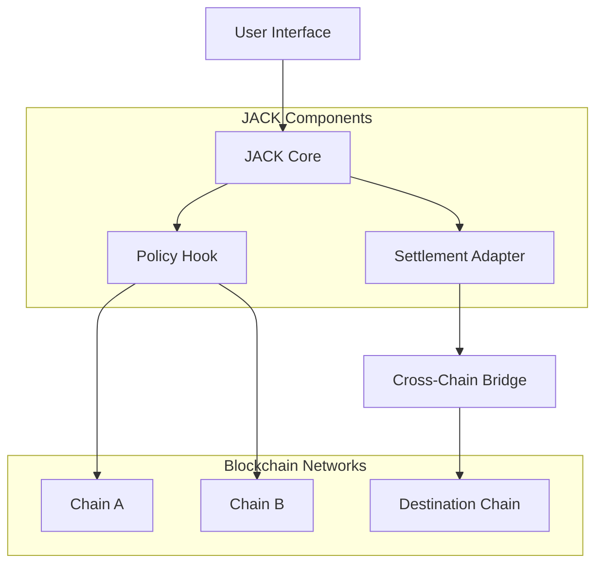

<div align="center">

</div>

# JACK - XChain Exec Kernel

[](https://github.com/hashpass-tech/jack/actions)
[](https://github.com/hashpass-tech/jack/docs)
[](LICENSE)

## Overview

JACK is a cross-chain execution kernel that enables seamless interoperability between different blockchain networks. This project provides a robust infrastructure for executing cross-chain transactions and managing multi-chain operations.

## Architecture



## Features

- **Cross-Chain Execution**: Execute transactions across multiple blockchain networks
- **Policy Management**: Flexible policy hooks for transaction validation
- **Settlement Layer**: Robust settlement adapter for finalizing cross-chain operations
- **Developer SDK**: Comprehensive SDK for integration with existing applications
- **Dashboard Interface**: Intuitive web dashboard for monitoring and management

## Quick Start

**Prerequisites:** Node.js, Git

1. Clone the repository:
   ```bash
   git clone https://github.com/hashpass-tech/jack.git
   cd jack
   ```

2. Install dependencies:
   ```bash
   npm install
   ```

3. Set up environment variables:
   ```bash
   cp .env.example .env.local
   # Edit .env.local with your configuration
   ```

4. Run the development server:
   ```bash
   npm run dev
   ```

## Project Structure

```
jack/
├── apps/
│   ├── dashboard/          # Web dashboard
│   └── landing/           # Landing page
├── contracts/             # Smart contracts
├── packages/
│   └── sdk/               # TypeScript SDK
├── components/            # Shared React components
└── docs/                  # Documentation
```

## Documentation

- [API Reference](./docs/api.md)
- [Smart Contract Integration](./docs/contracts.md)
- [SDK Usage Guide](./docs/sdk.md)
- [Deployment Guide](./docs/deployment.md)

## Contributing

We welcome contributions! Please read our [Contributing Guide](CONTRIBUTING.md) for details on our code of conduct and the process for submitting pull requests.

## License

This project is licensed under the MIT License - see the [LICENSE](LICENSE) file for details.
