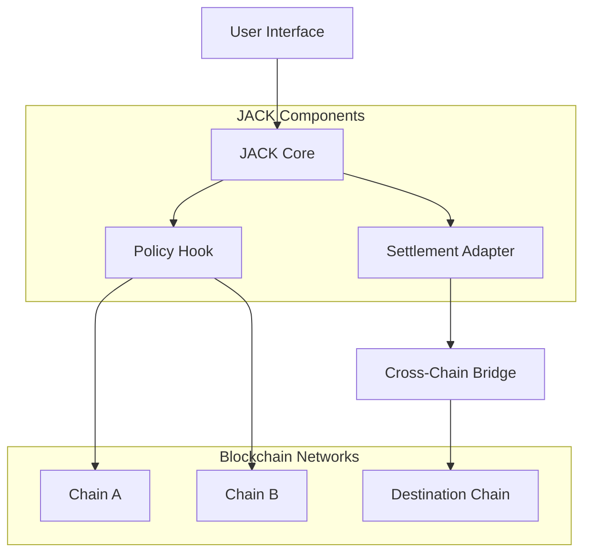

<div align="center">

</div>

# JACK - XChain Exec Kernel

[](https://github.com/hashpass-tech/jack/actions/workflows/deploy-docs-pages.yml)
[](https://github.com/hashpass-tech/jack/actions/workflows/docs-impact.yml)
[](https://github.com/hashpass-tech/jack/actions/workflows/agent-ci.yml)
[](LICENSE)
[](https://discord.gg/7k8CdmYHpn)
[](https://x.com/Jack_kernel)

## Overview

JACK is a cross-chain execution kernel that enables seamless interoperability between different blockchain networks. **Mission:** provide deterministic, intent-first execution by pairing a Kernel state machine with policy Hooks that enforce routing and settlement guardrails.

## Architecture



## Features

- **Cross-Chain Execution**: Execute transactions across multiple blockchain networks
- **Policy Management**: Flexible policy hooks for transaction validation
- **Settlement Layer**: Robust settlement adapter for finalizing cross-chain operations
- **Developer SDK**: Comprehensive SDK for integration with existing applications
- **Dashboard Interface**: Intuitive web dashboard for monitoring and management

## Current System State (February 7, 2026)

- `develop` includes merged execution/API work from PR `#20` (Yellow notification/auth/persistence flow) and PR `#21` (LI.FI quote/route/status integration + `/api/quote` endpoint).
- Issues `#17` and `#18` are closed as merged into `develop`.
- Dashboard API now exposes `GET /api/quote` and enriched intent metadata for LI.FI + Yellow execution evidence.
- Explicit fallback mode exists for LI.FI when provider calls fail or inputs are unsupported.
- Yellow provider callbacks support ERC-7824 (Nitrolite) channel metadata/guards (`channelId`, `channelStatus`, `stateIntent`, `stateVersion`, optional adjudicator + challenge period checks).
- Remaining hardening work is tracked in follow-up issue `#22` (lint/type cleanup and provider-state reliability tightening).

## 3-Step Setup Guide

**Prerequisites:** Node.js, Git

1. **Clone + install**

   ```bash
   git clone https://github.com/hashpass-tech/jack.git
   cd jack
   pnpm install
   ```

2. **Configure environment**

   ```bash
   cp .env.production.example .env.local
   # Edit .env.local with your configuration
   ```

3. **Run the apps**

   ```bash
   pnpm dev:landing   # http://localhost:3000
   pnpm dev:dashboard # http://localhost:3001
   pnpm dev:docs      # http://localhost:3002
   ```

   Or run all apps concurrently:

   ```bash
   pnpm dev:all
   ```

## Project Structure

```
jack/
├── apps/
│   ├── dashboard/          # Web dashboard
│   ├── docs/              # Docusaurus documentation app
│   └── landing/           # Landing page
├── contracts/             # Smart contracts
├── packages/
│   └── sdk/               # TypeScript SDK
├── components/            # Shared React components
```

## Documentation

- [Docs Platform](https://docs.jack.lukas.money/docs)
- [Mission & Overview](./apps/docs/docs/overview.md)
- [Architecture](./apps/docs/docs/architecture.md)
- [Demo Narrative](./docs/demo-script.md)
- [Contracts (Foundry)](./contracts/README.md)
- [Contracts Deployment Runbook](./apps/docs/docs/operations/contracts-deployment.md)
- [Documentation Governance Runbook](./apps/docs/docs/operations/documentation-governance.md)
- [Documentation Changelog](./apps/docs/docs/operations/documentation-changelog.md)
- [Whitepaper Portal](./apps/docs/docs/whitepaper/index.mdx)
- [Whitepaper Changelog](./apps/docs/docs/whitepaper/changelog.md)
- [MVP Critical Roadmap](./apps/docs/docs/operations/mvp-critical-roadmap.md)

## Community

- **Discord**: [Join our community](https://discord.gg/7k8CdmYHpn)
- **X (Twitter)**: [@Jack_kernel](https://x.com/Jack_kernel)
- **GitHub**: [hashpass-tech/JACK](https://github.com/hashpass-tech/JACK)

## Security

JACK enforces multiple layers of security linting to protect against common vulnerabilities:

- **Pre-commit hooks**: Automated checks before each commit
- **ESLint security rules**: Detects command injection, unsafe patterns, and more
- **Secret detection**: Prevents accidental exposure of credentials
- **CI/CD enforcement**: All PRs are automatically scanned for security issues

For detailed information, see [Security Linting Documentation](./docs/SECURITY_LINTING.md).

### Running Security Checks Locally

```bash
# Run all linters
pnpm run lint

# Check for secrets
npx secretlint "**/*"

# Custom secret check
./scripts/check-secrets.sh
```

## Contributing

We welcome contributions! Please read our [Contributing Guide](CONTRIBUTING.md) for details on our code of conduct and the process for submitting pull requests.

## Releases

Releases are driven by `@edcalderon/versioning` and the `pnpm release*` scripts in the root package. After you commit every change set, run the release helper to bump the version, regenerate the changelog, build `landing` + `dashboard`, and (optionally) run the docs release step and sync artifacts to your configured GCloud buckets.

Supported commands:

```bash
pnpm release        # patch release
pnpm release:minor  # minor release
pnpm release:major  # major release
pnpm release:all        # patch release + docs deploy (landing/dashboard/docs)
pnpm release:all:minor  # minor release + docs deploy
pnpm release:all:major  # major release + docs deploy
pnpm release -- --with-docs         # include docs build
pnpm release -- --with-docs-deploy  # include docs build + trigger Pages deploy workflow
pnpm release -- --skip-deploy       # local/tag-only release (no GCS/Cloud Run deploy)
pnpm release:docs                   # docs-only build
pnpm release:docs:deploy            # docs-only build + workflow dispatch
pnpm whitepaper:build               # compile/sync all whitepaper artifacts from whitepaper/manifest.json
pnpm whitepaper:validate            # validate whitepaper assets + manifest sync
pnpm docs:impact:check              # validate docs impact for critical paths
pnpm version:check                  # validate root/dashboard/changelog version sync
```

The helper respects these environment variables to upload every release to GCloud:

- `GCLOUD_PROJECT`: target GCloud project ID.
- `GCLOUD_LANDING_BUCKET`: target bucket for the landing build (`dist/`).
- `GCLOUD_LANDING_REGION`: bucket region (defaults to `us-west1` in setup script).
- `GCLOUD_WHITEPAPER_BUCKET`: optional bucket to keep `apps/landing/public/whitepaper/` exports in sync with release paths.
- `GCLOUD_RUN_SERVICE`: Cloud Run service name for the dashboard deployment.
- `GCLOUD_RUN_REGION`: Cloud Run region (e.g. `us-west1`).
- `GCLOUD_RUN_ALLOW_UNAUTH`: set to `true` to allow unauthenticated access.
- `GOOGLE_APPLICATION_CREDENTIALS`: path to a service account JSON key used for `gcloud`/`gsutil` auth.

The script uses `gsutil -m rsync -r` to mirror the built artifacts into `gs://<bucket>/` and `gs://<bucket>/releases/v<version>/…`, then deploys the dashboard to Cloud Run if `GCLOUD_RUN_SERVICE` is defined. Make sure `gcloud` + `gsutil` are installed and authenticated before running the release command.

### Docs deployment + DNS

- GitHub Pages workflow: `.github/workflows/deploy-docs-pages.yml`
- Docs custom domain file: `apps/docs/static/CNAME`
- Cloud DNS helper: `scripts/gcloud/configure-docs-dns.sh`
- Docs impact gate workflow: `.github/workflows/docs-impact.yml`
- Docs changelog automation workflow: `.github/workflows/docs-changelog.yml`
- PR merge automation workflow: `.github/workflows/pr-merge-automation.yml` (auto-close linked issues + optional follow-up issue creation)
- Docs deploy runs: <https://github.com/hashpass-tech/jack/actions/workflows/deploy-docs-pages.yml>
- Agent CI runs: <https://github.com/hashpass-tech/jack/actions/workflows/agent-ci.yml>

Example DNS mapping command:

```bash
GCLOUD_PROJECT=your-project \
GCLOUD_DNS_ZONE=lukas-money \
DOCS_DOMAIN=docs.jack.lukas.money \
DOCS_GITHUB_PAGES_TARGET=hashpass-tech.github.io \
./scripts/gcloud/configure-docs-dns.sh
```

### Testnet setup

Use the helper scripts in `scripts/gcloud/` to configure a bucket for `https://testnet.jack.lukas.money` and deploy the current `develop` release:

```bash
GCLOUD_PROJECT=your-project \
GCLOUD_LANDING_BUCKET=your-landing-bucket \
GCLOUD_LANDING_REGION=us-west1 \
GCLOUD_LANDING_PUBLIC=true \
GOOGLE_APPLICATION_CREDENTIALS=/path/to/service-account.json \
./scripts/gcloud/setup-testnet.sh

GCLOUD_PROJECT=your-project \
GCLOUD_LANDING_BUCKET=your-landing-bucket \
GCLOUD_RUN_SERVICE=jack-dashboard-testnet \
GCLOUD_RUN_REGION=us-west1 \
GCLOUD_RUN_ALLOW_UNAUTH=true \
GOOGLE_APPLICATION_CREDENTIALS=/path/to/service-account.json \
./scripts/gcloud/deploy-testnet.sh
```

## License

This project is licensed under the MIT License - see the [LICENSE](LICENSE) file for details.
