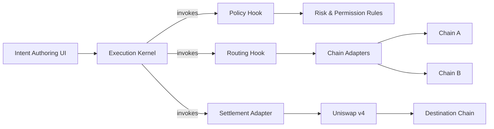
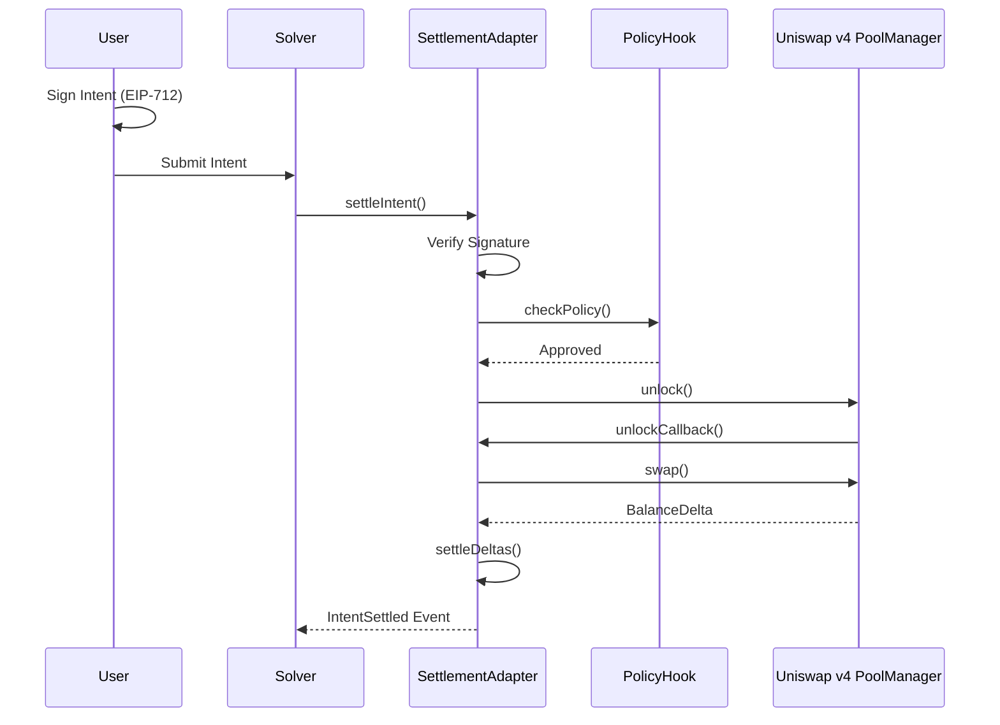
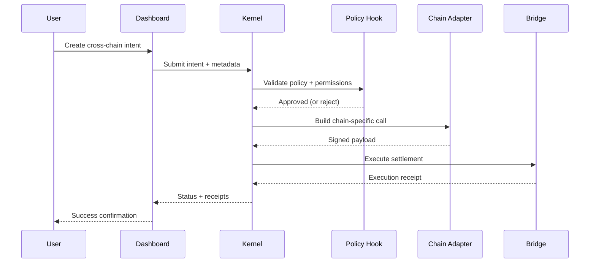

# JACK Architecture

The JACK architecture is centered on a deterministic **Kernel** that coordinates execution and a set of **Hooks** that enforce policy, routing, and settlement behavior.

## Kernel ↔ Hook Relationship

**Key idea:** Hooks never bypass the Kernel. The Kernel owns the execution state machine, while Hooks provide opinionated decisions at each stage.

## Settlement Layer Architecture

The **JACKSettlementAdapter** provides production-ready on-chain settlement through Uniswap v4:

### Settlement Features

- **EIP-712 Signatures**: Users sign intents with cryptographic guarantees
- **Solver Authorization**: Permissioned solver network with owner control
- **Policy Enforcement**: Integration with JACKPolicyHook for intent validation
- **Atomic Execution**: Leverages Uniswap v4 unlock/callback pattern
- **Reentrancy Protection**: Guards against reentrancy attacks
- **Delta Settlement**: Handles token transfers for swap completion

See [Settlement Adapter Documentation](./contracts/settlement-adapter.md) for detailed information.

## Critical Execution Flow

## Operational Guarantees

- **Deterministic status tracking**: the Kernel emits state transitions for every intent.
- **Pluggable enforcement**: swap Hook logic without rewriting the Kernel.
- **Observable execution**: Dashboard and Runbooks surface the same lifecycle steps for operators.
