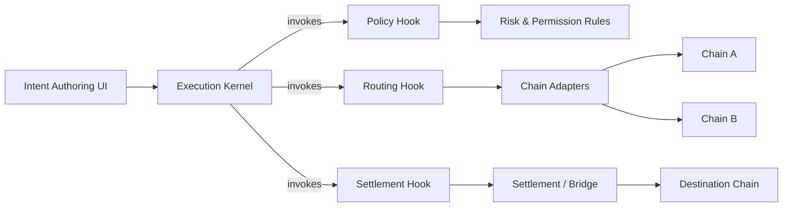
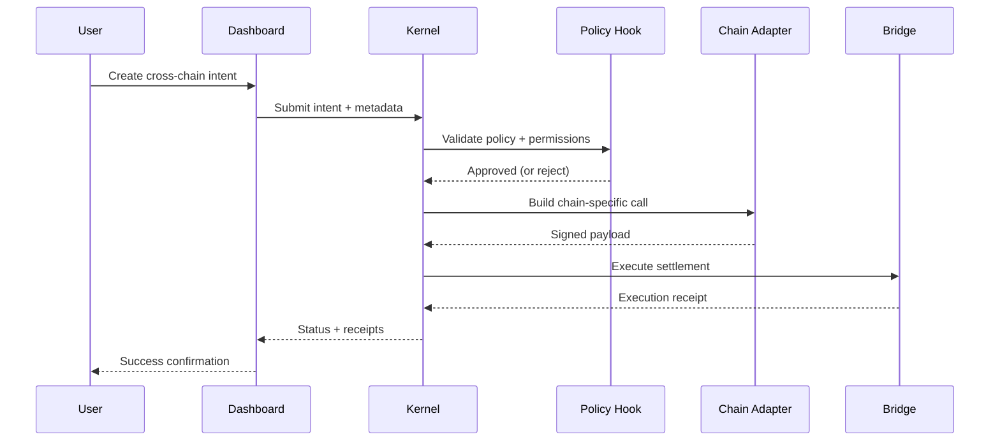

# JACK Architecture

The JACK architecture is centered on a deterministic **Kernel** that coordinates execution and a set of **Hooks** that enforce policy, routing, and settlement behavior.

## Kernel ↔ Hook Relationship

**Key idea:** Hooks never bypass the Kernel. The Kernel owns the execution state machine, while Hooks provide opinionated decisions at each stage.

## Critical Execution Flow

## Operational Guarantees

- **Deterministic status tracking**: the Kernel emits state transitions for every intent.
- **Pluggable enforcement**: swap Hook logic without rewriting the Kernel.
- **Observable execution**: Dashboard and Runbooks surface the same lifecycle steps for operators.
