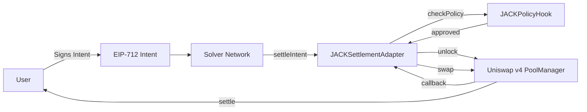

# JACK Smart Contracts

## Overview

The JACK protocol is powered by a suite of smart contracts built on Uniswap v4 that enable intent-based cross-chain execution with policy enforcement and secure settlement.

## Core Contracts

### JACKSettlementAdapter

**Status**: ✅ Production Ready

The settlement adapter is the primary interface for executing user intents on-chain. It integrates EIP-712 signature validation, solver authorization, and atomic swap execution through Uniswap v4.

**Key Capabilities**:
- Validates signed user intents
- Authorizes solver network
- Executes atomic token swaps
- Integrates with policy enforcement
- Provides reentrancy protection

[View Full Documentation →](./settlement-adapter.md)

### JACKPolicyHook

**Status**: 🚧 Development

The policy hook enforces protocol rules and risk management constraints on intent settlement. It validates intents before execution to ensure compliance with system policies.

**Key Capabilities**:
- Intent validation
- Volume limits
- Rate limiting
- Token allowlists
- Risk thresholds

Documentation coming soon.

## Architecture



## Contract Addresses

### Testnet

Coming soon - contracts are currently in development.

### Mainnet

Not yet deployed - production launch pending.

## Development

### Setup

Clone the repository and install dependencies:

```bash
git clone https://github.com/hashpass-tech/JACK.git
cd JACK/contracts
forge install
```

### Build

```bash
forge build
```

### Test

```bash
forge test
```

### Deploy

See [Contracts Deployment Runbook](../operations/contracts-deployment.md) for detailed deployment instructions.

## Security

### Audits

- [ ] External security audit (planned)
- [ ] Bug bounty program (planned)

### Testing

All contracts include comprehensive test suites covering:
- Happy path functionality
- Error cases and reverts
- Security boundaries
- Reentrancy protection
- Access control

### Best Practices

- Uses OpenZeppelin battle-tested libraries
- Follows Checks-Effects-Interactions pattern
- Implements reentrancy guards
- Validates all external inputs
- Emits events for state changes

## Resources

- [Contract Source Code](https://github.com/hashpass-tech/JACK/tree/main/contracts)
- [Foundry Documentation](https://book.getfoundry.sh/)
- [Uniswap v4 Hooks](https://docs.uniswap.org/contracts/v4/concepts/hooks)
- [EIP-712 Specification](https://eips.ethereum.org/EIPS/eip-712)

## Contributing

We welcome contributions to the JACK smart contracts. Please ensure all changes include:

1. Comprehensive tests
2. Clear documentation
3. Gas optimization considerations
4. Security review

See our [Contributing Guide](https://github.com/hashpass-tech/JACK/blob/main/CONTRIBUTING.md) for more details.
