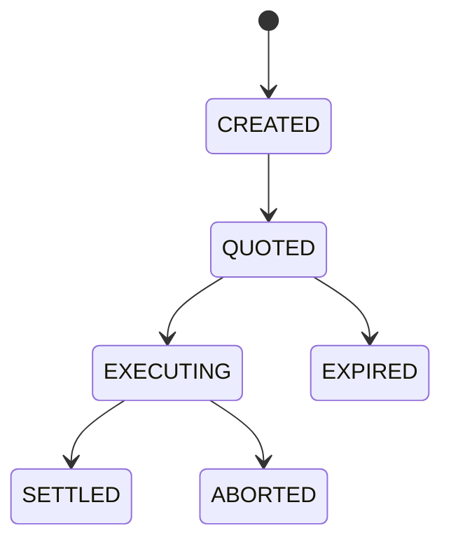

# JACK Whitepaper v1.0.2 (Simplified)

## Executive Summary

JACK is an intent-first execution kernel for cross-chain DeFi. Users declare outcomes, not step-by-step transactions. Solvers compete to execute those intents, routing is delegated through providers like LI.FI, and final settlement is guarded by on-chain policy hooks.

## What Changed in v1.0.2

- Added deterministic `/api/quote` behavior with explicit `provider` vs `fallback` mode.
- Documented the current LI.FI quote/route/status integration contract.
- Documented Yellow provider notification ingestion, authentication, and persistence flow.
- Added implementation mapping and process diagrams to align the whitepaper with the deployed system.

## System Model

JACK is modeled as:

`K = <Intent, Solver, Constraint, Routing, Venue>`

- `Intent`: user objective + constraints.
- `Solver`: execution plan generation and competition.
- `Constraint`: privacy and policy checks (CCM).
- `Routing`: bridge/DEX path selection (LI.FI in v1).
- `Venue`: on-chain settlement (Uniswap v4 hooks).

## API and Provider Contract (Current)

- `POST /api/intents`: create intent and persist metadata.
- `GET /api/quote`: deterministic quote response.
  - `mode=provider`: LI.FI returned a valid response.
  - `mode=fallback`: JACK returned a controlled fallback quote with reason code.
- Yellow callbacks: authenticated provider events are persisted and applied to intent lifecycle transitions.

## Process Diagram: Lifecycle



## Process Diagram: Deterministic Quote Mode

```mermaid
flowchart TD
    A[/api/quote request] --> B[LI.FI quote route status]
    B --> C{Valid provider response}
    C -->|yes| D[mode=provider]
    C -->|no| E[mode=fallback + reason]
```

## Security Guarantees (v1)

- Policy enforceability at settlement via hooks.
- Intent and execution integrity through signed intents and verified evidence.
- Fail-closed behavior when constraints or policy checks fail.
- Explicit failure states and reason codes for operator visibility.

## Known Limits

- No atomic cross-chain settlement guarantees in v1.
- No trustless bridge security guarantees in v1.
- No production-ready FHE+ZK privacy proofs in v1.

## References

- Full LaTeX whitepaper source: `whitepaper/tex/JACK-Whitepaper-v1.0.2.tex`
- PDF artifact: `JACK-Whitepaper-v1.0.2.pdf`
- Manifest source of truth: `whitepaper/manifest.json`
